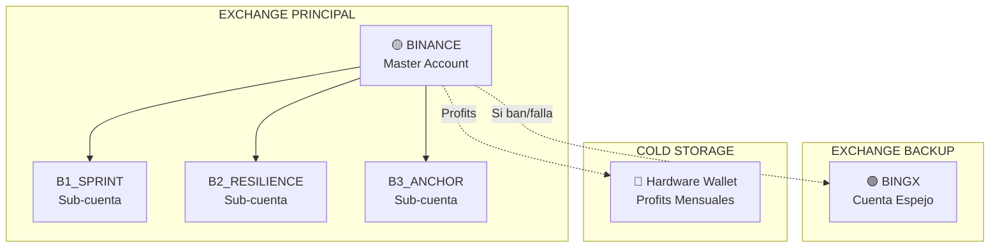

# Guía de Configuración de Exchanges - Trifecta Perfecta
## Binance (Principal) + BingX (Backup)

> [!NOTE]
> Esta guía prioriza la validación en Testnet antes de arriesgar capital real. Seguimos el protocolo de **30 días de prueba** del Rigor Híbrido 6A.

---

## Arquitectura de Exchanges



---

## Índice de la Guía

| Parte | Contenido | Exchange |
|-------|-----------|----------|
| **PARTE 1** | Crear 3 Sub-cuentas | Binance |
| **PARTE 2** | Configurar API Keys | Binance |
| **PARTE 3** | Testnet (30 días) | Binance |
| **PARTE 4** | Configurar Backup | BingX |
| **PARTE 5** | Migración a Producción | Ambos |

---

# PARTE 1: Crear Sub-cuentas en Binance

## Paso 1.1: Acceder a Gestión de Sub-cuentas

1. Iniciar sesión en **https://www.binance.com**
2. Click en tu **icono de perfil** (esquina superior derecha)
3. Seleccionar **"Sub-cuenta"**

**URL directa:**
```
https://www.binance.com/es/my/sub-account/account-management
```

---

## Paso 1.2: Crear Primera Sub-cuenta (B1_SPRINT)

1. Click en **"+ Crear Sub-cuenta"**

2. Completar el formulario:

| Campo | Valor |
|-------|-------|
| **Email** | `tu_email+b1sprint@gmail.com` |
| **Etiqueta/Nombre** | `B1_SPRINT` |
| **Tipo** | Cuenta estándar de sub-cuenta |

> [!TIP]
> Gmail permite usar `+alias` - todos los emails llegarán a tu buzón principal pero Binance los ve como direcciones únicas.

3. Click **"Crear"**
4. Verificar por email si es requerido
5. Completar 2FA si se solicita

---

## Paso 1.3: Crear Segunda Sub-cuenta (B2_RESILIENCE)

Repetir el proceso con estos datos:

| Campo | Valor |
|-------|-------|
| **Email** | `tu_email+b2resilience@gmail.com` |
| **Etiqueta/Nombre** | `B2_RESILIENCE` |
| **Tipo** | Cuenta estándar de sub-cuenta |

---

## Paso 1.4: Crear Tercera Sub-cuenta (B3_ANCHOR)

Repetir el proceso con estos datos:

| Campo | Valor |
|-------|-------|
| **Email** | `tu_email+b3anchor@gmail.com` |
| **Etiqueta/Nombre** | `B3_ANCHOR` |
| **Tipo** | Cuenta estándar de sub-cuenta |

---

## Paso 1.5: Verificar Creación

En el panel de Sub-cuentas debes ver:

```
✅ B1_SPRINT     - Activa
✅ B2_RESILIENCE - Activa
✅ B3_ANCHOR     - Activa
```

---

## Paso 1.6: Habilitar Futures en Cada Sub-cuenta

Para **CADA** sub-cuenta:

1. Click en el nombre de la sub-cuenta
2. Ir a **"Funciones"** o **"Features"**
3. Habilitar **"Futures"**
4. Aceptar términos si es necesario

---

## Paso 1.7: Configurar Modo ISOLATED (CRÍTICO)

> [!CAUTION]
> Este paso es OBLIGATORIO. Sin modo ISOLATED, la liquidación de un motor puede afectar a los demás.

Para **CADA** sub-cuenta, acceder a Futures:

1. En la sub-cuenta, ir a **Derivados → USDⓈ-M Futures**
2. En cualquier par (ej: BTCUSDT), buscar el selector de margen
3. Cambiar de **Cross** a **Isolated**

### Configuración por Motor:

| Sub-cuenta | Modo Margen | Modo Posición | Apalancamiento Máx |
|------------|-------------|---------------|-------------------|
| B1_SPRINT | **ISOLATED** | Hedge Mode | 20x |
| B2_RESILIENCE | **ISOLATED** | Hedge Mode | 5x |
| B3_ANCHOR | **ISOLATED** | One-Way | 3x |

Para configurar apalancamiento:
1. Click en el número de apalancamiento (ej: "20x")
2. Ajustar al máximo permitido según la tabla

---

## ✅ Checklist Parte 1

- [ ] Sub-cuenta B1_SPRINT creada
- [ ] Sub-cuenta B2_RESILIENCE creada
- [ ] Sub-cuenta B3_ANCHOR creada
- [ ] Futures habilitado en las 3
- [ ] Modo ISOLATED configurado en las 3
- [ ] Apalancamiento límite configurado

---

# PARTE 2: Crear API Keys

## Paso 2.1: API Key para B1_SPRINT

1. Acceder a la sub-cuenta B1_SPRINT
2. Ir a **Perfil → API Management**
3. Click **"Crear API"**

### Configuración:

| Campo | Valor |
|-------|-------|
| Etiqueta | `API_B1_SPRINT` |
| Enable Reading | ✅ |
| Enable Futures | ✅ |
| Enable Spot | ❌ |
| Enable Withdrawals | ❌ **NUNCA** |
| IP Restriction | ✅ (agregar IP del VPS cuando lo tengas) |

4. Guardar **API Key** y **Secret Key** inmediatamente

```bash
# En tu .env.production
B1_API_KEY=xxxxx
B1_API_SECRET=xxxxx
```

---

## Paso 2.2: API Key para B2_RESILIENCE

Repetir proceso exacto:

| Campo | Valor |
|-------|-------|
| Etiqueta | `API_B2_RESILIENCE` |
| Permisos | Reading ✅, Futures ✅, Withdrawals ❌ |

---

## Paso 2.3: API Key para B3_ANCHOR

Repetir proceso exacto:

| Campo | Valor |
|-------|-------|
| Etiqueta | `API_B3_ANCHOR` |
| Permisos | Reading ✅, Futures ✅, Withdrawals ❌ |

---

## Paso 2.4: API de Monitor (Cuenta Master)

En tu cuenta **MASTER** (no sub-cuenta):

| Campo | Valor |
|-------|-------|
| Etiqueta | `API_MONITOR_READONLY` |
| Enable Reading | ✅ |
| Todo lo demás | ❌ |

---

## ✅ Checklist Parte 2

- [ ] API_B1_SPRINT creada con permisos correctos
- [ ] API_B2_RESILIENCE creada con permisos correctos
- [ ] API_B3_ANCHOR creada con permisos correctos
- [ ] API_MONITOR_READONLY creada
- [ ] Todas guardadas en `.env.production`
- [ ] **NINGUNA** tiene Withdrawals habilitado

---

# PARTE 3: Testnet (30 Días de Validación)

## Paso 3.1: Crear Cuenta en Binance Testnet

```
URL: https://testnet.binancefuture.com
```

1. Registrarse (cuenta separada del Binance real)
2. Obtener fondos ficticios: **Wallet → Get Test Funds**

---

## Paso 3.2: Crear API de Testnet

En Testnet: **Profile → API Management → Create**

```bash
# En tu .env.testnet
TESTNET_API_KEY=xxxxx
TESTNET_API_SECRET=xxxxx
ENVIRONMENT=testnet
```

---

## Paso 3.3: Período de Validación

| Día | Objetivo |
|-----|----------|
| 1-7 | Verificar conectividad y latencia |
| 8-14 | Probar ejecución de órdenes |
| 15-21 | Simular escenarios de estrés |
| 22-30 | Validar métricas finales |

### Métricas de Aprobación:

| Métrica | Mínimo Requerido |
|---------|------------------|
| Latencia | < 100ms |
| Uptime | > 99% |
| Max Drawdown | < 15% |

---

# PARTE 4: Configurar BingX como Backup

> [!IMPORTANT]
> BingX es tu plan B. Configurarlo ANTES de necesitarlo.

## Paso 4.1: Crear Cuenta BingX

```
URL: https://bingx.com
```

1. Registrarse con email diferente (recomendado)
2. Completar KYC básico
3. **NO depositar fondos aún**

---

## Paso 4.2: Configuración Espejo

En BingX, preparar la configuración equivalente:

| Binance | BingX Equivalente |
|---------|-------------------|
| Sub-cuenta B1_SPRINT | Etiqueta mental "B1" |
| Sub-cuenta B2_RESILIENCE | Etiqueta mental "B2" |
| Sub-cuenta B3_ANCHOR | Etiqueta mental "B3" |

> [!NOTE]
> BingX no tiene sub-cuentas. La segregación será por disciplina de capital en el bot.

---

## Paso 4.3: Crear API Key de BingX

```
Account → API Management → Create API
```

| Configuración | Valor |
|---------------|-------|
| Etiqueta | `BINGX_BACKUP` |
| Perpetual Swap Trade | ✅ |
| Spot Trade | ❌ |
| Withdrawal | ❌ **NUNCA** |
| IP Whitelist | ✅ (cuando tengas VPS) |

Guardar en `.env.production`:
```bash
# BACKUP EXCHANGE
BINGX_API_KEY=xxxxx
BINGX_API_SECRET=xxxxx
BINGX_ENABLED=false  # Activar solo si Binance falla
```

---

## Paso 4.4: Cuándo Activar BingX

Activar el backup si:

| Evento | Acción |
|--------|--------|
| Binance bloqueado/baneado | Migrar fondos a BingX |
| API de Binance caída > 1 hora | Operar temporalmente en BingX |
| Restricciones regionales | Usar BingX como principal |

---

## ✅ Checklist Parte 4

- [ ] Cuenta BingX creada
- [ ] KYC completado
- [ ] API Key generada (sin fondos)
- [ ] Credenciales guardadas en `.env.production`
- [ ] BINGX_ENABLED=false configurado

---

# PARTE 5: Migración a Producción

> [!CAUTION]
> Solo después de 30 días exitosos en Testnet.

## Paso 5.1: Transferir Fondos (Gradual)

| Fase | Capital por Motor | Total |
|------|-------------------|-------|
| Inicial | $300 | $900 |
| Semana 2 | $500 | $1,500 |
| Semana 4+ | $1,000 | $3,000 |

### Proceso:
```
Binance → Wallet → Transferir
├── De: Cuenta Principal - Spot
├── A: Sub-cuenta [nombre] - Futures USDⓈ-M
├── Moneda: USDT
└── Cantidad: [según fase]
```

---

## Paso 5.2: Activar Restricción de IP

**ANTES de operar con dinero real:**

1. Obtener IP del VPS: `curl ifconfig.me`
2. En CADA API Key de Binance:
   - Editar → IP Restriction → Agregar IP
3. En API Key de BingX:
   - Editar → IP Whitelist → Agregar IP

---

## Paso 5.3: Cambiar Entorno

En `.env.production`:
```bash
ENVIRONMENT=production
BINANCE_FUTURES_URL=https://fapi.binance.com
BINGX_ENABLED=false  # Backup listo pero inactivo
```

---

## Resumen Final

```
📁 BINANCE (Producción)
├── 🟡 Master Account
│   ├── 📂 B1_SPRINT ($1,000, ISOLATED, 20x)
│   ├── 📂 B2_RESILIENCE ($1,000, ISOLATED, 5x)
│   └── 📂 B3_ANCHOR ($1,000, ISOLATED, 3x)
│
📁 BINGX (Backup - Sin fondos)
└── 🟢 Cuenta configurada, lista para emergencia

📁 HARDWARE WALLET
└── 🔐 Extraer profits mensualmente
```

---

## Cronograma Sugerido

| Día | Actividad |
|-----|-----------|
| Hoy | Crear 3 sub-cuentas Binance + APIs |
| Hoy | Crear cuenta BingX (backup) |
| Hoy | Configurar Testnet |
| Días 1-30 | Validación en Testnet |
| Día 31+ | Migración gradual a producción |
